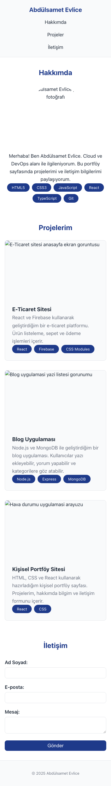
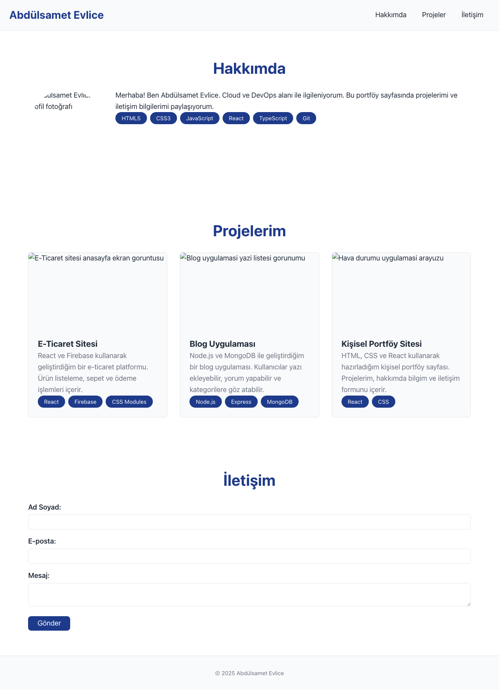

# Web LAB-1 - Hello Project

Bu proje Web Tasarımı ve Programlama LAB-1 kapsamında  
Vite + React + TypeScript ile oluşturulmuştur.

## Kişisel Bilgiler
- Ad Soyad: Abdülsamet Evlice  
- Öğrenci No: 230541003  
- Bölüm: Yazılım Mühendisliği  
- Hobiler: Dizi-Film İzlemek  

## Kullanılan Teknolojiler
- React 18  
- TypeScript  
- Vite  

## Kurulum ve Çalıştırma
```bash
npm install
npm run dev
```

Tarayıcıda: http://localhost:5173

## LAB-3: Responsive Web Design

### Ekran Görüntüleri (Screenshots)
#### Mobile (375px)


#### Tablet (768px)


#### Desktop (1280px)


