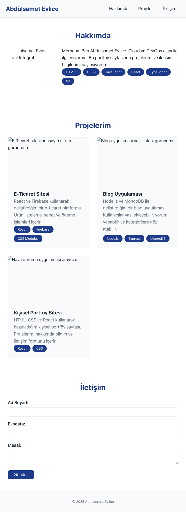

# React + TypeScript + Vite

This template provides a minimal setup to get React working in Vite with HMR and some ESLint rules.

Currently, two official plugins are available:

- [@vitejs/plugin-react](https://github.com/vitejs/vite-plugin-react/blob/main/packages/plugin-react) uses [Babel](https://babeljs.io/) (or [oxc](https://oxc.rs) when used in [rolldown-vite](https://vite.dev/guide/rolldown)) for Fast Refresh
- [@vitejs/plugin-react-swc](https://github.com/vitejs/vite-plugin-react/blob/main/packages/plugin-react-swc) uses [SWC](https://swc.rs/) for Fast Refresh

## React Compiler

The React Compiler is not enabled on this template because of its impact on dev & build performances. To add it, see [this documentation](https://react.dev/learn/react-compiler/installation).

## Expanding the ESLint configuration

If you are developing a production application, we recommend updating the configuration to enable type-aware lint rules:

```js
export default defineConfig([
  globalIgnores(['dist']),
  {
    files: ['**/*.{ts,tsx}'],
    extends: [
      // Other configs...

      // Remove tseslint.configs.recommended and replace with this
      tseslint.configs.recommendedTypeChecked,
      // Alternatively, use this for stricter rules
      tseslint.configs.strictTypeChecked,
      // Optionally, add this for stylistic rules
      tseslint.configs.stylisticTypeChecked,

      // Other configs...
    ],
    languageOptions: {
      parserOptions: {
        project: ['./tsconfig.node.json', './tsconfig.app.json'],
        tsconfigRootDir: import.meta.dirname,
      },
      // other options...
    },
  },
])
```

You can also install [eslint-plugin-react-x](https://github.com/Rel1cx/eslint-react/tree/main/packages/plugins/eslint-plugin-react-x) and [eslint-plugin-react-dom](https://github.com/Rel1cx/eslint-react/tree/main/packages/plugins/eslint-plugin-react-dom) for React-specific lint rules:

```js
// eslint.config.js
import reactX from 'eslint-plugin-react-x'
import reactDom from 'eslint-plugin-react-dom'

export default defineConfig([
  globalIgnores(['dist']),
  {
    files: ['**/*.{ts,tsx}'],
    extends: [
      // Other configs...
      // Enable lint rules for React
      reactX.configs['recommended-typescript'],
      // Enable lint rules for React DOM
      reactDom.configs.recommended,
    ],
    languageOptions: {
      parserOptions: {
        project: ['./tsconfig.node.json', './tsconfig.app.json'],
        tsconfigRootDir: import.meta.dirname,
      },
      // other options...
    },
  },
])
```

## LAB-3: Responsive Web Design

### Ekran Görüntüleri (Screenshots)
#### Mobile (375px)


#### Tablet (768px)


#### Desktop (1280px)


### CSS Kararları

#### 1. Breakpoint Seçimi
- Mobil odaklı tasarım (mobile-first) ile ilerlediğim için, varsayılan akışı 0 - 639px ekran aralığında tanımladım.
- İlk kırılımı 640px'den başlatarak tablet görünümüne geçiş sağladım: header elemanlarını yatay düzenle listeledim ve form alanlarındaki "gönder" butonunu tam genişlikten çıkartıp optimize ettim.
- Desktop görünümü için 1024px üzerinde bir breakpoint ekledim: projedeki kart yapılarını (Grid) üç eşit sütuna böldüm ve kapsayıcı genişliğini (main) ortalayarak 1200px'de sınırlandırdım.

#### 2. Layout Tercihleri
- Sayfanın iskelet yapısını kontrol etmek, aynı satırda çoklu hizalama işlemlerini sağlamak için esnek flex-box mantığı kullandım (örneğin header: auto flex-direction).
- Proje kartlarının dikey ve yatay koordinatlarda boşluk hesaplamasını (gap) ve otomatik sığmasını kontrol etmek amacıyla iki boyutlu Grid metodu kullandım (`auto-fit`, `minmax(280px, 1fr)`). Media query sayısını sıfırlayıp akıcı grid düzeni sağladım.

#### 3. Design Tokens
- Renk paleti için gözü yormayacak ama okunaklılığı yüksek, yaygın kullanılan (TailwindCSS tabanlı) `primary/secondary/accent` mantığını `/src/styles/tokens.css` içerisinde CSS Variables ile (design tokens) yönettim.
- Spacing (boşluk) ve Border-radius ölçü aralıkları da tutarlılık oluşturacak şekilde (`-sm`, `-md`, `-xl`) belirli rem metriklerine ve grid hesaplarına bağlandı.
- Responsive typography uyumu için `clamp()` fonksiyonunu dahil ettim (örneğin `--text-base: clamp(1rem, 0.9rem + 0.5vw, 1.125rem);`); böylece cihaz veya ebat ayırt etmeksizin orantısal okunabilirlik elde ettim.

#### 4. Responsive Stratejiler
- Her aşamada mobil tasarımdan desktop'a doğru (`min-width`) media queries genişletme kuralını benimsedim.
- Navigasyon listesi mobil tarafta (`flex-direction: column`) dikeyde hizalanıyorken, tablet tarafında yataya döküldü. Card grid auto-fit metoduyla kendi kendine responsive kaldı.
- Resim öğelerini, kabına uyacak şekilde `max-width: 100%; height: auto; object-fit: cover` standartları ile boyutlandırdım.
